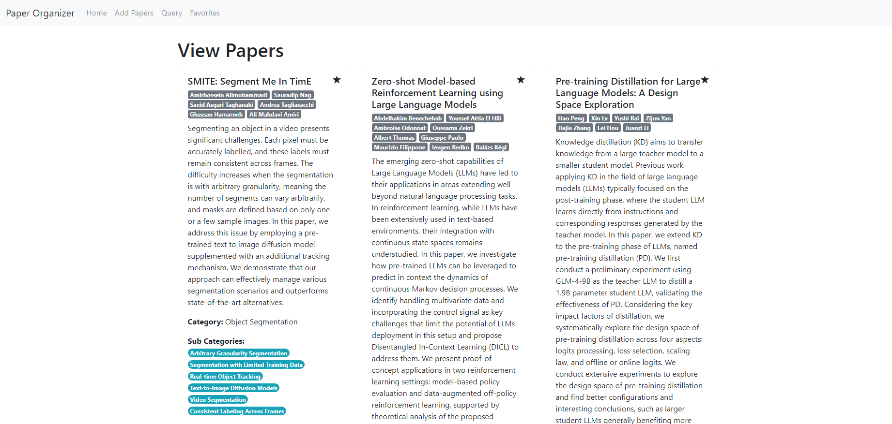
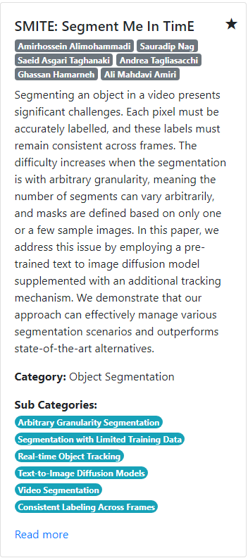
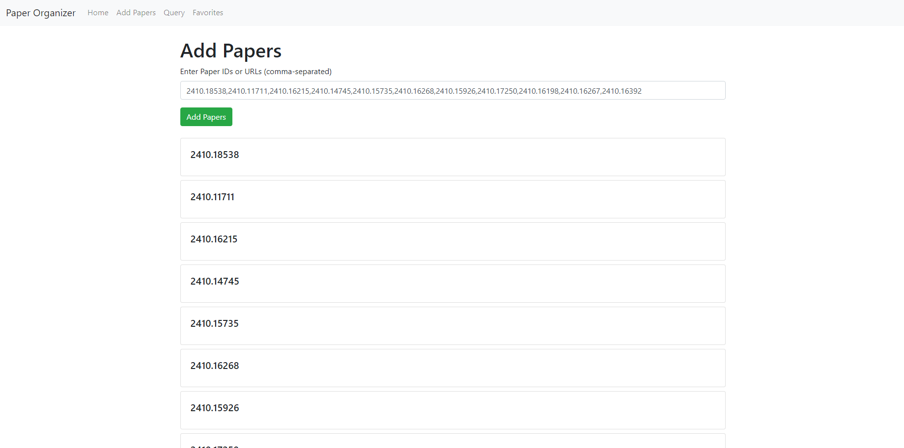
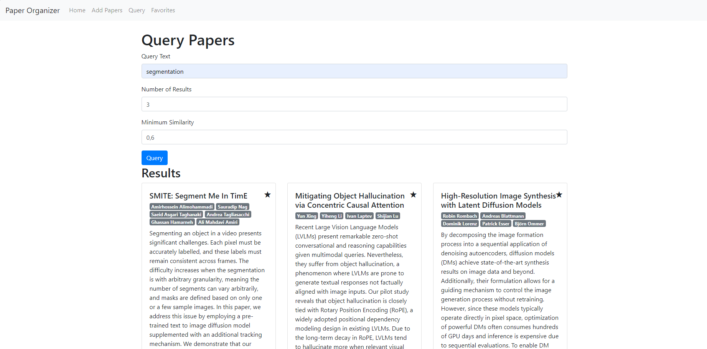
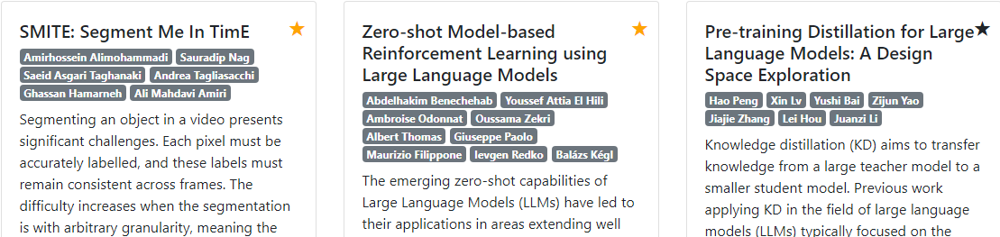
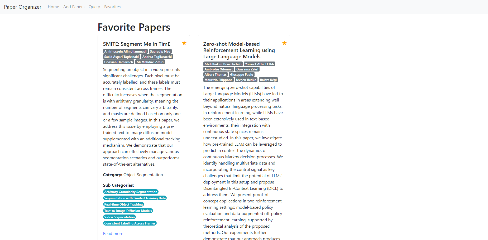

# Paper Organizer

An LLM-based paper organizer desktop program.

## Table of Contents

- [Paper Organizer](#paper-organizer)
    - [Table of Contents](#table-of-contents)
    - [Introduction](#introduction)
    - [Features](#features)
    - [Installation](#installation)
    - [Usage](#usage)
    - [Screens](#screens)
        - [Home Screen](#home-screen)
        - [Add Papers](#add-papers)
        - [Query Papers](#query-papers)
        - [Favorites](#favorites)
    - [Contributing](#contributing)
    - [License](#license)

## Introduction

Paper Organizer is a desktop application designed to help researchers and academics organize their papers using advanced language models. The application categorizes, generates embeddings, and stores papers in a vector database for easy retrieval and management.

## Features

- **Categorization**: Automatically categorize papers based on their content.
- **Embedding Generation**: Generate embeddings for papers to facilitate similarity searches.
- **Vector Database**: Store and manage paper embeddings in a vector database.

## Installation

To install the Paper Organizer, follow these steps:

1. Clone the repository:
    ```sh
    git clone https://github.com/doguscank/paper-organizer.git
    cd paper-organizer
    ```

2. Install dependencies using Poetry:
    ```sh
    poetry install
    ```

3. Set up the environment variables:
    ```sh
    cp src/.env.template src/.env
    # Edit src/.env with your configuration
    ```

## Usage

To run the application, use the following command:

```sh
poetry run python app.py
```

## Screens

The Paper Organizer application includes the following screens:

### 1. Home Screen

- **Description**: The home screen displays all the papers saved in the system.
- **Features**: Provides an overview of the papers, including titles, categories, and quick access options for each paper.


This screenshot shows the home screen of the Paper Organizer application, where users can see an overview of all their papers.



This screenshot shows a paper card. A card includes the title, authors, summary, category of the paper, and sub-categories of the paper. The user can read the paper by clicking the "Read more" text.


### 2. Add Papers

- **Description**: A screen to add new papers to the organizer.
- **Features**: Allows users to upload papers, categorize them, and generate embeddings.




This screenshot shows the add papers screen of the Paper Organizer application, where users can fetch papers from arXiv or HuggingFace using URLs or IDs.


### 3. Query Papers

- **Description**: A screen to query the database for specific papers.
- **Features**: Allows users to search for papers based on various criteria and view the results.



This screenshot shows the query papers screen of the Paper Organizer application, where users can search for specific papers using various filters and criteria.


### 4. Favorites

- **Description**: A screen to view favorite papers.
- **Features**: Displays a list of papers marked as favorites for quick access.



This screenshot shows the action of adding a paper to the favorites by clicking on the star icon on right-top corner of a paper card.



This screenshot shows the favorites screen of the Paper Organizer application, where users can view and manage their favorite papers.


Each screen is designed to provide a seamless and intuitive user experience, making it easy to manage and organize your papers.

## How It Works

### Large Language Models (LLMs)

The Paper Organizer application leverages Large Language Models (LLMs) to extract meaningful information from research papers. This includes summarizing papers, extracting key concepts, and generating metadata. The LLMs are integrated into the backend to process the papers as they are added to the system.

#### Models Used

- **SciBERT**: Used for generating embeddings and metadata specific to scientific papers.
- **LLaMA 3.2 3B**: Used for summarizing papers and extracting key concepts via the Groq API.

#### Libraries Used

- **Transformers**: A library by Hugging Face that provides easy access to pre-trained models like SciBERT.
- **PyTorch**: A deep learning framework used to run the models.
- **Groq API**: Used to access the LLaMA 3.2 3B model for advanced language processing tasks.

### Vector Databases

To efficiently store and query the extracted information, the application uses vector databases. These databases store the metadata and embeddings generated by the LLMs, allowing for fast and accurate searches. When a user queries the database, the system retrieves the most relevant papers based on the vector similarity.

#### Libraries Used

- **FAISS**: A library by Facebook AI Research that provides efficient similarity search and clustering of dense vectors.


### Full Process Overview

```mermaid
graph TD
    subgraph Add Papers
        A1[User] -->|Fetch Paper| B1[Add Papers Screen]
        B1 -->|Submit URL/ID| C1[Backend]
        C1 -->|Fetch Metadata| D1[arXiv/HuggingFace API]
        D1 -->|Return Metadata| C1
        C1 -->|Process with LLMs| E1[LLaMA 3.2 3B Groq API]
        E1 -->|Generate Metadata| F1[Database]
        E1 -->G1[SciBERT]
        G1 --> |Generate Embeddings| H1[FAISS Vector Database]
    end

    subgraph Query Papers
        A2[User] -->|Search Query| B2[Query Papers Screen]
        B2 -->|Submit Query| C2[Backend]
        C2 -->|Retrieve Metadata| D2[FAISS Vector Database]
        D2 -->|Return Results| C2
        C2 -->|Display Results| B2
    end

    subgraph Manage Favorites
        A3[User] -->|Add to Favorites| B3[Favorites Screen]
        B3 -->|Click Star Icon| C3[Backend]
        C3 -->|Update Favorites| D3[Database]
        D3 -->|Confirm Update| C3
        C3 -->|Update UI| B3
    end
```



## Contributing

We welcome contributions! Please follow these steps to contribute:

1. Fork the repository.
2. Create a new branch (`git checkout -b feature-branch`).
3. Make your changes.
4. Commit your changes (`git commit -m 'Add some feature'`).
5. Push to the branch (`git push origin feature-branch`).
6. Open a pull request.

## License

This project is licensed under the MIT License. See the [LICENSE](LICENSE) file for details.
